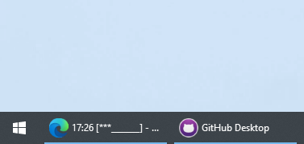

# Motivation

I was looking for a nice Pomodoro timer in Win 10 that can keep the remaining time in the taskbar,
like "Flow" in macOS.
No, I cannot find such a nice, simple app that does the same thing.
Yep, when it comes to simplicity and visual appealing, Mac is Light Years ahead of Windows.
So I decided to just make one by myself.
I made a web site that displays the time on the title.
Currently, it is barebone and ugly,
because I want to use it as soon as possible before I get to work today.

# Usage
Make sure you have the taskbar setting as below so that you can see the title of the sites. As I always do so, it is not a problem for me:

Visit the Github site: https://urfdvw.github.io/title_timer/

Minimize the window, and enjoy your workflow

# TODOs
- UI for setting time and easy Pomodoro timer options
- Nicer look

