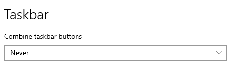
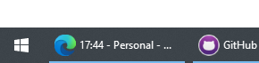
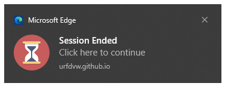

# Motivation

I was looking for a nice Pomodoro timer in Win 10 that can keep the remaining time in the taskbar,
like "Flow" in macOS.
No, I cannot find such a nice, simple app that does the same thing.
Yep, when it comes to simplicity and visual appealing, Mac is Light Years ahead of Windows.
So I decided to just make one by myself.
I made a web site that displays the time on the title, 
so that you can always see it in the taskbar.

# Usage
Make sure you have the taskbar setting as below so that you can see the title of the sites. As I always do so, it is not a problem for me:

Visit the Github site: https://urfdvw.github.io/title_timer/

Minimize the window, and enjoy your work.

Turn on browser notifications to receive end information.

# TODOs
- Nicer look

# Known issues
- Web seems to be freezing after a session, and click on notification cannot start a break.